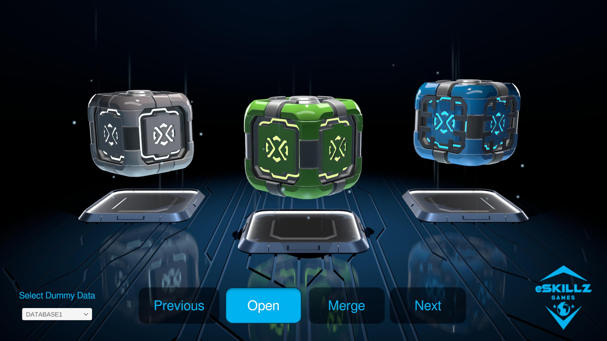
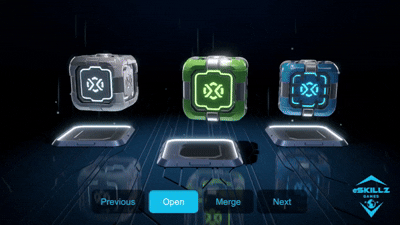

# 🎁 Crate Carousel System (Unity)

A stylized 3D **lootbox carousel system** built in Unity, featuring smooth navigation, crate opening animations, and a merge mechanic to upgrade crate tiers.

---

## 📸 Showcase




---

## ✨ Features

* 🔄 **3D Carousel Navigation**

  * Cycle through crates using Next / Previous
  * Smooth transitions between positions

* 📦 **Crate Opening System**

  * Animated opening sequence
  * Controlled interaction flow

* 🔗 **Merge Mechanic**

  * Combine two crates of the same type
  * Upgrade to higher-tier crates
  * Visual feedback + VFX

* 🧠 **Data-Driven Setup (Mock DB)**

  * JSON-based crate data simulation
  * Easily switch between datasets via UI

* 🎛️ **UI Integration**

  * Dropdown to swap datasets
  * Confirmation & feedback windows

---

## 🧱 Crate Tier Progression

| Tier      | Result        |
| --------- | ------------- |
| Common    | Uncommon      |
| Uncommon  | Uncommon      |
| Rare      | Epic          |
| Epic      | Legendary     |
| Legendary | (loops/reset) |

---

## 🕹️ Controls

* **Next / Previous Buttons** → Navigate carousel
* **Open Button** → Open selected crate
* **Merge Button** → Select and combine crates
* **Dropdown** → Switch crate datasets

---

## 🗂️ Project Structure

```bash
Assets/
├── Scripts/
│   └── CratesManager.cs
├── Prefabs/
│   └── Crates (by type)
├── VFX/
│   └── Merge effects
├── UI/
│   └── Canvas + Windows
```

---

## ⚙️ Setup Instructions

1. Open the project in Unity
2. Ensure all references are assigned in `CratesManager`:

   * `cratePrefabs`
   * `SpawnLocations`
   * UI elements (merge windows, dropdown, etc.)
3. Press Play 🎮

---

## 🔌 How the Data Works

The system uses a mock JSON database:

```json
{
  "data": {
    "crates": [
      { "id": "001", "type": "Common" },
      { "id": "002", "type": "Rare" }
    ]
  }
}
```

You can switch datasets using the enum:

```csharp
DUMMY_DATABASE_SELECTOR
```

---

## 🔄 Future Improvements

* Replace dummy JSON with real backend
* Save/load player crate inventory
* Add rarity-based drop tables
* Improve merge balancing logic
* Mobile input support (swipe carousel)

---

## 🧠 Tech Notes

* Uses coroutines for animation timing
* Animator-driven transitions
* Dynamic prefab spawning system
* Modular data structure (ready for backend integration)

---

## 📸 Showcase


---

## 📌 Author

Pedro Firmino
Tech Artist / Unity Developer
